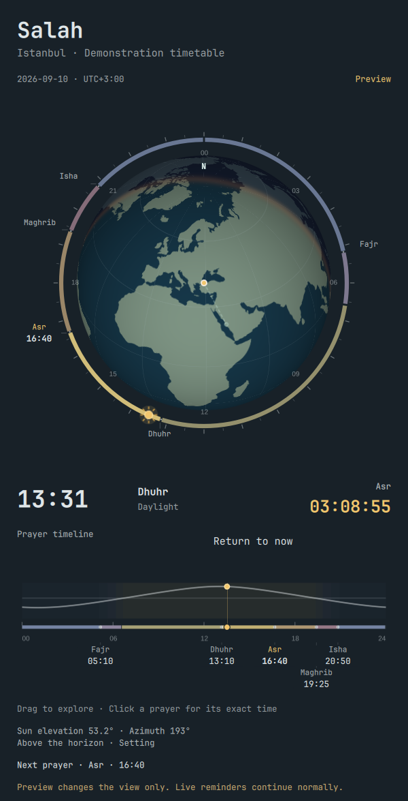

# Salah for Omarchy

A small, open-source prayer companion for the Omarchy desktop. A mosque in the bar helps you notice prayer time without taking over your screen.

**Status: 0.3.12, public beta.** The plugin targets Omarchy 4's Quickshell plugin API. It has been developed against Omarchy 4.0.3. Other desktop shells are not supported yet.



*Preview uses a synthetic demonstration timetable.*

## Earth clock

The default panel contains a circular Earth view centred on your selected location,
with north up and a gold location marker. Its daylight boundary follows a local
Astronomy Engine calculation. The timeline shows the sun’s apparent
centre elevation through the day, with azimuth and rising/setting status below. Calculated sunrise
and sunset refer to the sun’s upper edge at a level horizon; terrain and weather
can change what you observe.

The outer ring shows the selected prayer timetable, with subtle hour and
half-hour marks and prayer labels. Only the upcoming prayer’s exact time stays
visible; hover or keyboard focus reveals the other times. After Isha, Fajr’s
upcoming time carries a **+1** marker for tomorrow. A golden sun marker
follows the daily clock. Beneath the globe, a gold countdown to the next prayer
sits opposite the current time. After Isha it
uses tomorrow’s dated Fajr when available. Optional amber hatching shows Diyanet
guidance. Solar phases remain available in the interval details and the globe’s
lighting. Click the ring or a prayer label, or use **Select an interval**, for
times and explanations. Focus the ring and use the arrow keys to select an
interval. Beneath the globe, a sun-elevation curve and coloured prayer timeline
replace the plain horizon line and slider. Hover for time/interval details;
click or drag to explore the day, or click a prayer label to jump to its exact
time and explanation. Arrow keys step through the timeline one minute at a time.
The timeline uses the current local day, including 23- and 25-hour days.
**Preview** affects this panel only: live reminders continue using the real clock. **Return to now**, closing the panel, or changing its day ends
preview. Multiple panels can be explored independently.

The small gear contains **Panel view → Earth / Classic** and **Prayer guidance →
Diyanet / Off**. Earth interface text is available in English, Turkish, and Arabic.
Solar calculations need coordinates, obtained from the saved location or provider
response. Older city-only caches can show the timetable until an updated response
supplies coordinates. For local imports, add optional top-level metadata:

```json
"coordinates": {"latitude": 51.5, "longitude": 0.0}
```

Use the coordinates of the imported timetable, along with its IANA timezone.
Imports without coordinates remain usable as timetables.

Settings automatically show the local **Qibla direction** in degrees clockwise
from true north. **Show qibla on Earth** adds a thin, muted, dashed guide from the gold
location marker to Makkah’s actual projected position. A small endpoint marks
Makkah on the visible hemisphere. When it is on the far side, the guide fades at
the globe’s horizon instead of placing a false endpoint on the near side; the globe stays north-up and the sun-height time chart remains
unchanged. The option defaults to off and saves immediately when toggled. You can
go straight back to the globe; the choice survives closing settings and restarting
the shell. This switch saves only Qibla visibility, leaving other draft settings
for the Save button, and does not reload the timetable.
The bearing is calculated locally from saved coordinates or the selected
provider/import coordinates, including offline use. It does not change prayer
times or make a separate network request. Editing a city hides its old bearing
until the new coordinates are available. No guide is drawn where a unique bearing
is undefined, including the geographic poles, the Kaaba and its antipode.
The great-circle calculation follows the geometry documented in
[Adhan's Qibla implementation](https://github.com/batoulapps/adhan-js/blob/main/src/Qibla.ts).

### Diyanet guidance estimates

Amber hatching means an **estimate**, based on
[Diyanet’s explanation of discouraged prayer periods](https://kurul.diyanet.gov.tr/tr/fetva/mekruh-vakitler-hangileridir-hangi-vakitlerde-kaza-ve-hangi/0193c42d-52b7-7186-d5b4-f1d3c950ad73).
The initial profile uses:

| Band | Estimated display boundary |
| --- | --- |
| Sunrise kerâhet | Calculated sunrise through 45 minutes afterwards |
| Midday kerâhet | 10 minutes before timetable Dhuhr through Dhuhr |
| Sunset kerâhet | 45 minutes before calculated sunset through sunset |

Diyanet describes roughly 40–50 minutes for the sunrise/sunset periods in moderate
regions. These are not universal astronomical thresholds or official published
Diyanet times. The detail panel explains prayer-specific exceptions, including
that day’s obligatory Asr, and the conditional guidance for voluntary prayers.
Missing solar events, missing Dhuhr, polar conditions, out-of-day bands, or
overlapping estimates suppress these bands and show an unavailable message.

Provider-adjusted sunrise and Maghrib remain on the prayer ring; astronomical
sunrise and sunset remain in the solar details. Choosing Diyanet guidance does not
change AlAdhan’s calculation method, Asr convention, or reminder times.

Earth calculations and bundled geography require no network or additional
runtime packages. Solar data is cached separately for three dated local days;
provider outages do not stop the local solar calculation. Rendering stops when
all Earth panels are closed. The precompiled Qt shader uses the GPU when available,
with a bundled software-rendered fallback.

## Reminder behaviour

| When | Mosque | Click |
| --- | --- | --- |
| 30 minutes before Fajr or Dhuhr | Yellow outline | Dismiss this reminder |
| 30 minutes before Asr, Maghrib or Isha | Red outline | Dismiss this reminder |
| At prayer time and for 30 minutes afterwards | Green outline | Dismiss this reminder |
| Between reminder windows | Your normal theme colour | Open the timetable |

Clicking also opens the timetable by default; this can be disabled. Right-click always opens the panel. Middle-click refreshes the schedule. Dismissal persists across shell restarts and is shared across monitors. A dismissed **before** reminder does not dismiss the separate **after** reminder. This is acknowledgement of a notification, not a record that you have prayed.

**Show countdown in the bar** saves immediately. Choose **Before prayer only**,
**After prayer only**, or **Before and after prayer**. Before prayer it shows the
time until that prayer, using the mosque’s yellow or red reminder colour. After
prayer it shows time left in the green reminder window for the prayer that just
started. This is the reminder duration, not the end of the prayer’s valid time.
The countdown hides between reminder windows and after dismissal.

The windows can be changed independently from 0 to 120 minutes. They start exactly at the configured boundary and end at prayer time / the end of the after window. If windows overlap, the prayer that just started takes priority. Sunrise is displayed for information and never triggers a prayer reminder.

## Install

Requirements: Omarchy 4 / Quickshell, Python 3.10+ with timezone data, and `notify-send`. Optional audio uses PipeWire's `pw-play`. No pip or npm packages are required at runtime.

```sh
omarchy plugin add https://github.com/durak1frt-cyber/omarchy-salah --enable --yes
```

To install from a downloaded source archive, extract it, open a terminal in its directory, and run:

```sh
python3 scripts/install.py
```

This validates and copies the plugin to `~/.config/omarchy/plugins/salah.prayer-times`, rescans plugins, and enables it. To replace the earlier Quattro prayer widget in its current bar position:

```sh
python3 scripts/install.py --replace local.prayer-times
```

The installer backs up the existing shell layout and any existing Salah installation. Replacing a widget changes its bar entry; it does not delete its source code or settings. Do not run the installer with sudo.

Update a Git-installed copy with `omarchy plugin update salah.prayer-times`.
See [release notes](CHANGELOG.md) for changes and known limitations.

## Set up

Open the mosque → **gear icon**. New installations default to automatic location: [wttr.in](https://github.com/chubin/wttr.in#usage) estimates the city from the network connection's public IP; Salah sends the detected city coordinates to `api.aladhan.com` to fetch prayer times. It caches the location for six hours, checks again on a forced refresh, and retains the last detected location during an outage. If a stale location is used, the panel says so. VPNs and mobile networks can produce a different city, so check the detected location.

**Automatic location** saves immediately and reloads the timetable. Switching it
off restores your saved manual location. Enter or edit the city and country in
manual mode and use **Save & fetch times** to apply those draft edits. Existing explicitly configured locations remain manual on upgrade. The detected coordinates are stored separately from your manual preferences; switching modes does not erase a saved city. Choose your calculation method and Asr convention in the same menu. Click **Save & fetch times** to apply changes. The shared Omarchy weather configuration is never modified.

English, Turkish, and Arabic prayer labels and core interface text are included. Calculation-method names follow the provider catalogue; some settings and diagnostic text are currently English. Translation contributions are welcome.

The first provider is [AlAdhan](https://aladhan.com/prayer-times-api), with the [available calculation methods](https://aladhan.com/calculation-methods). Its Turkey/Diyanet option is labelled **experimental by the API**; it is a calculation preset, not an import of Diyanet's published timetable. Select the method appropriate for your community and compare against its timetable before relying on alerts. Polar locations with unavailable times show a schedule error instead of inventing times.

For precise coordinates or a timezone override, edit `~/.config/salah/config.json` while the shell is stopped, then start it again:

```json
{
  "provider": "aladhan",
  "locationMode": "manual",
  "city": "Display label",
  "country": "",
  "latitude": 0.0,
  "longitude": 0.0,
  "timezone": "UTC",
  "method": 3,
  "school": 0
}
```

Those coordinates are an example, not a suggested location. Coordinate mode sends coordinates to AlAdhan rather than the display label. Salah checks that returned coordinates match the request before accepting new times. Saved coordinates appear in Settings; editing the city or country switches back to city-name lookup. Use an IANA timezone such as `Europe/London`; otherwise the API's location timezone is used. Restarting the shell reads externally edited settings. GUI changes apply immediately.

## Offline timetable import

Select **Local timetable** and provide a JSON file using the format in [examples/timetable.json](examples/timetable.json). The example contains synthetic times and is not for worship. Supply dated rows from your chosen published timetable, including tomorrow and preferably yesterday. Local files are read without network access; there is no geocoding step.

Network schedules cache yesterday, today, and tomorrow. Cached dates continue to work offline. Missing adjacent dates are shown as a warning. Salah never copies today's Fajr into tomorrow, and expired dates do not generate fresh reminders. Uncached future dates require a connection. Failed requests retry after one minute, slowing to two, four, eight, then fifteen minutes for repeated failures. A longer server `Retry-After` delay takes precedence. Ordinary cache refresh is hourly.

HTTP 503 means the provider or a service it depends on is temporarily unavailable; it does not establish that the location is incorrect. Salah distinguishes these outages from invalid requests and rate limits, preserves available cached dates, and retries automatically. Restarting the desktop is not required to retry.

## Visuals and sound

- A compact mosque outline uses one dome and one minaret, without a surrounding ring.
- One gentle opacity pulse marks a new window. Disable **Gentle animation** for reduced motion; colour and text remain available.
- Native desktop notifications appear once when each reminder window starts. Startup and resume do not play a backlog of missed alerts.
- Audio is **silent by default**. Enable original soft chimes or select your own local adhan/audio file. Pre-prayer reminders use the approaching chime; a personal adhan plays at prayer time.
- Audio has its own volume setting and never changes the system volume. Clicking the mosque or **Stop audio** stops this plugin's current playback.
- Preview buttons show Dhuhr's yellow approaching and green just-started reminders for ten seconds and use the saved notification/audio preferences. Preview times are explicitly marked and never enter the live timetable or acknowledgement history.

## Development

```sh
node tests/model.test.cjs
node tests/solar-model.test.cjs
node tests/qibla.test.cjs
python3 -m unittest discover -s tests -p 'test_*.py' -v
LC_ALL=C omarchy plugin validate .
python3 scripts/check-qml.py  # graphical session; opens a temporary test window
python3 scripts/check-settings.py  # cached fixture locations; live network blocked
python3 scripts/check-earth.py
python3 scripts/check-earth.py --software --output dist/earth-software
python3 scripts/check-earth.py --scale 1.5 --output dist/earth-scale
```

`Model.js` contains the pure reminder rules. `prayer.py` provides configuration, provider requests, timezone-aware dated schedules, and atomic cache writes. `Service.qml` owns one clock and notification/audio worker for all monitors. `Widget.qml` and its presentation components render that shared state. Additional providers can return the same dated schedule format without changing the alert rules.

This release combines the Earth clock with reliable prayer reminders. The [official Diyanet Awqat Salah API](https://awqatsalah.diyanet.gov.tr/index.html) is a prospective additional provider. It requires approved credentials and has quotas; it is not implemented in this release. AlAdhan's Diyanet calculation preset should not be presented as direct official Diyanet data. Later work can add published Diyanet data, more languages and providers, Hijri calendar features, and other optional Islamic tools. Those features are not implemented in this version. The architecture deliberately keeps them separate from the reminder engine.

The native Earth harness requires QtTest, uses synthetic local timetables, and
makes no network requests. It exercises real hover, click, drag, and keyboard
events for the dial and timeline. It also checks
shader loading, software fallback, preview isolation, panel lifecycle, guidance
off, missing coordinates, provider outages, RTL, and keyboard focus, and saves
screenshots. Solar event tests compare with pinned USNO reference fixtures for
Greenwich and Sydney (two-minute tolerance), plus polar, cache, and DST cases.

To rebuild the shipped assets, run `python3 scripts/build-earth-assets.py`
(requires `rsvg-convert` and ImageMagick) and `python3 scripts/build-shaders.py`
(requires Qt 6 `qsb`). These are build tools only. The shader bundle was compiled
with Qt 6.11.2; test compatibility when targeting another Qt version. Pinned
vendored revisions, SHA-256 hashes, and licences are included. The
[preview](preview.png) is rendered from the real QML components with a synthetic
Istanbul timetable. Rebuild it with `python3 scripts/make-preview.py` in a graphical
session. The regression harness also saves native screenshots.

`SolarModel.js` builds immutable display intervals; `solar.py` calculates local
solar events and one-minute interpolation samples. `EarthPanel.qml` owns only
its preview clock, while `Service.qml` owns live reminders and counts visible
Earth consumers. Future guidance profiles can add rules without changing the
provider or reminder engines.

## Data and removal

- Preferences: `$XDG_CONFIG_HOME/salah/config.json` (normally `~/.config/salah/config.json`).
- Cached prayer dates, local solar samples, and reminder acknowledgements: `$XDG_STATE_HOME/salah/` (normally `~/.local/state/salah/`).
- No accounts, analytics, or bundled personal location. Automatic mode contacts wttr.in for approximate IP-based location, then AlAdhan for prayer times. Manual mode contacts only AlAdhan. Local timetable mode uses neither service.
- The automatic location cache stores a city, country, city coordinates, and detection timestamp; Salah does not save the public IP.
- AlAdhan is not a zero-logging service: a [reply on its official support forum](https://community.islamic.network/d/154-server-logs-log-retention-period) says request query parameters are logged. Prefer manual city-level requests or local timetable import if you want to avoid submitting coordinates.

Disable with `omarchy plugin disable salah.prayer-times`. Remove the plugin with `omarchy plugin remove salah.prayer-times --yes`; private settings/cache remain available for a later reinstall. Installer backup paths are printed during installation.

## License

MIT for original code and vector artwork. Astronomy Engine is MIT; Natural Earth geography is public domain. See the third-party notices. The original generated chimes are CC0; see [assets/LICENSE](assets/LICENSE). No third-party adhan recording is distributed.

The [Quattro prayer widget](https://github.com/husamemadH/omarchy-quattro-prayer-times) informed the initial Omarchy integration. Its attribution and license are preserved in [THIRD_PARTY_NOTICES.md](THIRD_PARTY_NOTICES.md).
